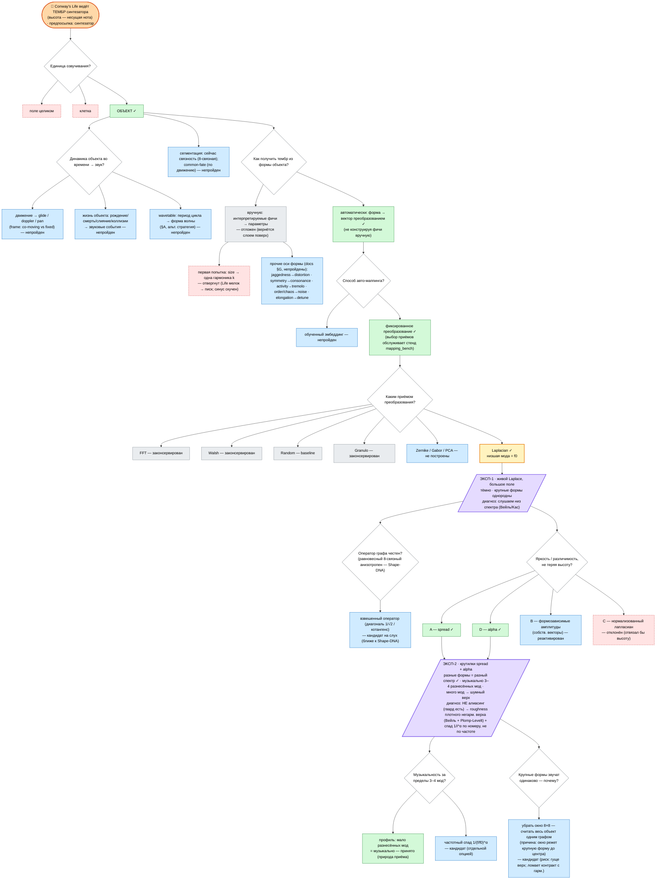

# Decision Tree — граф решений проекта (v3)

_Ведёт Researcher. Карта РАЗВИЛОК для навигации (где мы, что выбрано, что впереди),
НЕ летопись — полное «почему» и детали в `decisions.md`. Перенос в obsidian
(`ResearchMap.canvas`) — отдельным запросом._

## Правила ведения (чтобы граф не зарастал)
- **Вершины = вопросы И ответы.** Обычно чередуются (Q → ответ(ы) → новые Q → …), но
  НЕ обязательно явно: нода-ответ может неявно нести вопрос («какие бывают?»), и под ней
  висят под-ответы-варианты (напр. «вручную фичи» → конкретные фичи). Корень особый.
- **Эксперимент** (прослушивание реализации) — тоже вершина; может иметь НЕСКОЛЬКО
  родителей (опции, которые в него вошли) и порождать несколько вопросов. Итог —
  одной строкой; полный фидбек/диагноз в `decisions.md`. → граф это DAG, не дерево.
- **Предпосылка без альтернатив живёт ВНУТРИ родительской ноды** (напр. «низшая
  мода = f0» в Laplacian; «синтезатор» в корне). Оспорим → вытаскиваем её в
  отдельную развилку и ветвимся параллельно.
- **Инженерные задачи НЕ на графе** (огибающая/ADSR, сглаживание биений, кросс-фейд,
  sounddevice, slot-pool …) — это `decisions.md`/`log/`, не развилки рисёрча.
- **Непройденные ветки не удаляем** — висят со статусом, чтобы можно было вернуться.

## Легенда
🟩 выбрано/принято · 🟨 активная ветка · 🟥 отклонено · ⬜ законсервировано/отложено ·
🟦 кандидат/идея/не построено
формы: ◇ ромб = вопрос · ▭ прямоугольник = ответ · ▱ параллелограмм = эксперимент

